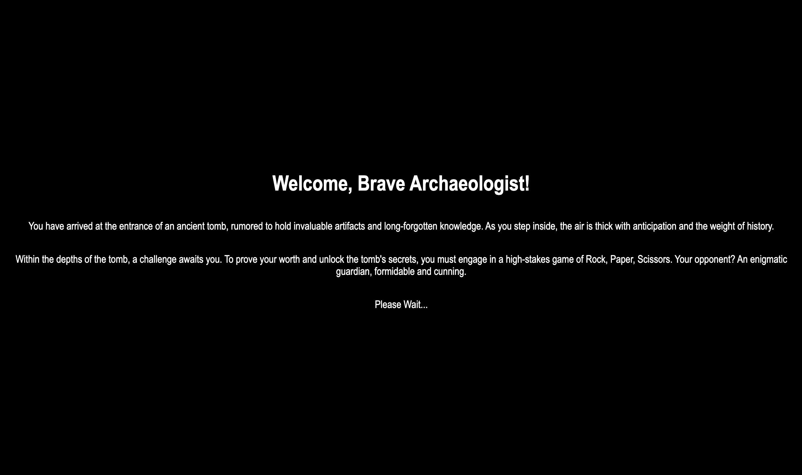

# rockPaperScissors

Create a Rock Paper Scissors Game!

# motivation 

Learn to create and a webpage integrated with JavaScript by creating an interactive 
game for user.

# Build Status

Project Complete

# Code Style

The JavaScript code in this project follows a consistent coding style to ensure readability and maintainability. Here are some key aspects of the code style:

- Variable and function names use camel case.
- Constants and values that are not expected to change are named using uppercase letters.
- Indentation is done using spaces (usually 2 or 4 spaces per level).
- Curly braces `{}` for control structures (if statements, loops, etc.) are placed on separate lines.
- Comments are used to explain the purpose of functions, variables, and code blocks.
- Descriptive variable and function names are used to enhance code clarity.

# Screenshots

# Tech/Framework used

- JavaScript
- HTML
- CSS
- Node.js

# Features

- Rock, Paper, Scissors game: Play the classic game against the computer with intuitive button controls.
- Random computer choices: The computer generates a random choice (rock, paper, or scissors) for each round.
- Score tracking: The player's and computer's scores are updated and displayed after each round.
- Best of 5 rounds: The winner of the best-of-five rounds is declared at the end of every 5 rounds.
- Responsive design: The user interface adapts to different screen sizes, providing a consistent experience across devices.

# Code Examples

// Example 1: Function to prompt the computer for a random choice
function getComputerChoice() {
  // ... code implementation
  return computerChoice;
}

// Example 2: Function to compare player and computer choices and determine the winner
function play(playerSelection, computerSelection) {
  // ... code implementation
  return result;
}

// Example 3: Event listener for player button click
rockButton.addEventListener('click', function() {
  playerButtonClick("ROCK");
  console.log('Player chooses ROCK!');
});

// Example 4: Function to update scores and check for a winner after each round
function updateScoreAndCheckWinner(result) {
  // ... code implementation
}

// Example 5: Creating and appending buttons for player options
const rockButton = document.createElement('button');
rockButton.textContent = 'ROCK';
// ... code to add event listener and append the button to the container

# Installation

1. Clone repository: git@github.com:adilshads/rockPaperScissors.git
2. Navigate to project directory: cd rockPaperScissors
3. npm install

# API reference

No API References

# Tests

# How to Use? 

1. Access the Game: You can play the Rock Paper Scissors game by visiting the following URL: https://adilshads.github.io/rockPaperScissors/   OR Launch the game by opening the index.html file in your web browser.

2. Follow the instructions outlined below to enjoy the game.

3. Game Rules: The game follows the classic rules of Rock Paper Scissors:

   Rock beats Scissors
   Paper beats Rock
   Scissors beats Paper
   User Interface: The game interface consists of three buttons representing the player's choices: Rock, Paper, and Scissors.

4. Making a Choice: Click on the button corresponding to your choice for each round. You can choose either Rock, Paper, or Scissors.

5. Computer's Choice: After you make your selection, the computer will randomly choose its own option.

6. Determining the Winner: The game will compare your choice with the computer's choice and determine the winner of the round based on the game rules mentioned above.

7. Score Tracking: The player's score and the computer's score will be updated and displayed after each round.

8. Best-of-Five Rounds: The game follows a best-of-five rounds format. The first player to win three rounds will be declared the winner of the game.

9. Displaying the Winner: At the end of every five rounds, the game will display the winner and reset the scores for a new game.

10. Play Again: To play again, simply click on your desired choice for the next round. The game will continue until one player reaches the best-of-five rounds victory or you choose to refresh the page.

11. Enjoy the Game: Have fun playing Rock Paper Scissors!

# Contribute

# Credits

Image Credit: [Pixabay](https://www.pexels.com/@pixabay/)

Image Credit: [Alexander Tsang](https://unsplash.com/@alexander_tsang)

![Rock] (https://pixabay.com/photos/rock-erosion-scenery-landscape-5352025/)

Image Credit: [Dimitris Vetsikas](https://pixabay.com/users/dimitrisvetsikas1969-1857980/)

Image Credit: [G.C.](https://pixabay.com/users/garten-gg-201217/)

Image Credit: [Everyday basics](https://unsplash.com/@zanardi)

[Fantasy Passage](https://pixabay.com/illustrations/passage-entrance-ice-dimension-7685853/)

Image Credit: [Alan Frijins](https://pixabay.com/users/alanfrijns-16705522/)

Image Credit: [Pizar Almualidina](https://pixabay.com/users/pizar_kestrap-12044322/)

# License

  